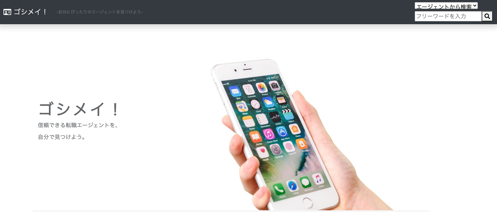
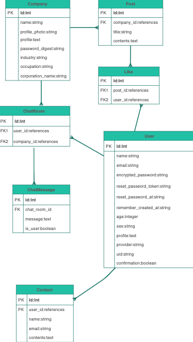
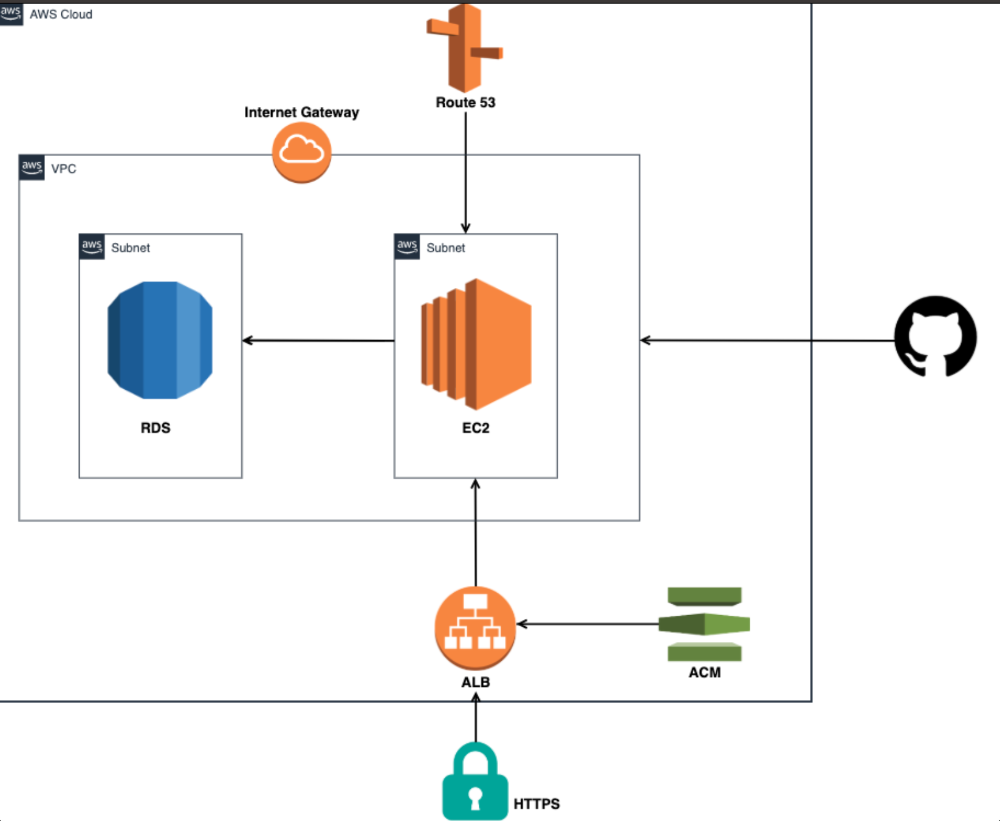

# ゴシメイ！
### 求職者が自分にマッチする好きなエージェントを検索・直接やりとりすることができるサービスです。

## URL
https://goshimei-agent.com

## サービスの概要
求職者が自分にマッチする好きなエージェントを検索・直接やりとりすることが
できるアプリです。
企業からのスカウトを待つのではなく、求職者が主体的にエージェントを
探すことができます。
求職者は無料で使用でき、求職者とマッチングし自社に登録いただけた場合、企業側
から手数料を頂くビジネスモデルです。

## ターゲット

* 求職者側
  * 転職を本格的に考えているが、何から始めればいいのか分からない、初めての転職活動の方。
    相性の良さそうなエージェントから丁寧にサポートしてほしい。
  * 業界経験が長く、業種知識が豊富なミドル〜シニア層。
    業界情報やキーパーソンとのコネクションがあるエージェントにサポートしてほしい。

* 企業側
  * 自社の求人や担当業界にマッチする求職者を集客したい人材エージェント。

## 使用技術
* 言語
  * HTML5 CSS JavaScript Ruby2.5
* データベース
  * MySQL5.7
* フレームワーク
  * Ruby on Rails5.2 Bootstrap
* インフラ
  * AWS
    * EC2 RDS VPC Route53 ElasticIP ACM
  * Unicorn Nginx

## 構成図
* ER図

* インフラ図

## このサービスを考えたきっかけ

以下3点がきっかけとなります。
* エージェントとして実際に働き求職者の方とやり取りをしている中で、日本の転職エージェント 　利用時の満足度は、「担当者」によって左右されると感じた。
  一方で、基本的に転職エージェントに登録した場合求職者は、エージェント側の担当を選ぶことはできず、その点に負があると思った。

* エージェント側のメリットとしても、支持を集める担当者は「どのエージェント会社に属している　か」というより「個人名」で顧客から信頼されており、「個人名」をPRすることができるサービス　はニーズがあるのではないかと考えた。

* また、中長期的には転職を考えた際に求職者が取る行動が変わってくると考えており、
  求職者が主体的に情報を集められるサービスは世の中に必要になってくるのではないかと感じた。
  * 現在
    * 「まず転職エージェントに登録する」
  * 今後
    * 「周りの転職体験を聞き、情報や口コミを集める」「SNSやYouTubeなどで情報を持ってい そうなエージェントを探す」

## 苦労した点、学び
* 多対多のモデル設計を実装するのに苦労しました。
* デバッグツールやコンソール、ログを用いて、変数内に適切な値が入っているか、データが
  作成できているか等を確認していたことで、デバッグの手法について勉強になりました。

## 今後の計画
* エージェント側の投稿をSNSと連携させることで、エージェントの人柄や得意領域などが
  わかる判断材料が増え、マッチングの精度を高めたいと考えています。